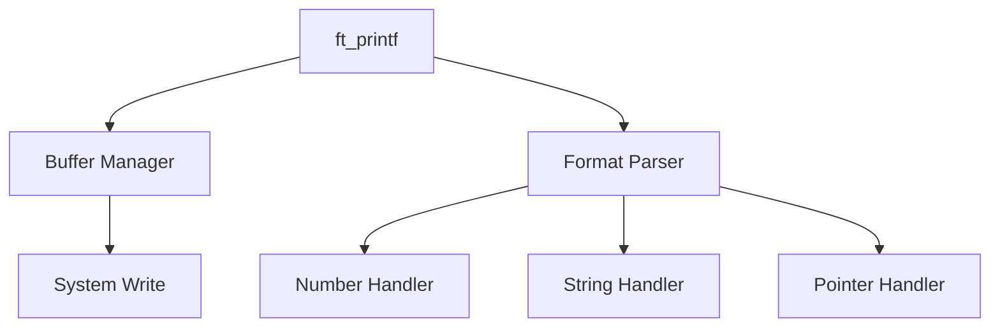

# 📝 ft_printf


> A high-performance, buffered implementation of printf with modular architecture and robust error handling.

## 📚 Table of Contents
- [Overview](#-overview)
- [Features](#-features)
- [Technical Architecture](#-technical-architecture)
- [API Reference](#-api-reference)
- [Implementation Deep Dive](#-implementation-deep-dive)
- [Performance Optimizations](#-performance-optimizations)
- [Usage Examples](#-usage-examples)
- [Building & Testing](#-building--testing)
- [Project Structure](#-project-structure)

## 🎯 Overview

`ft_printf` is a custom implementation of the standard C printf function, designed with:
- Buffered I/O for optimal performance
- Modular architecture for maintainability
- Comprehensive error handling
- Zero external dependencies (except libft)

## ⭐ Features

### Format Specifiers
| Specifier | Description | Example |
|-----------|-------------|---------|
| %c | Single character | `ft_printf("%c", 'A')` |
| %s | String | `ft_printf("%s", "Hello")` |
| %p | Pointer address | `ft_printf("%p", ptr)` |
| %d, %i | Signed decimal | `ft_printf("%d", 42)` |
| %u | Unsigned decimal | `ft_printf("%u", 42)` |
| %x, %X | Hexadecimal | `ft_printf("%x", 255)` |
| %% | Percent sign | `ft_printf("%%")` |

### Key Capabilities
- 🔄 Buffered Output System
- 🛡️ Buffer Overflow Protection 
- ⚡ Optimized System Calls
- 🎯 Edge Case Handling

## 🏗 Technical Architecture

### Core Structure
```c
typedef struct s_printf {
    va_list args;        // Variable arguments
    char    buffer[128]; // Output buffer
    int     buf_index;   // Current buffer position
    int     total_len;   // Total output length
    char    type;        // Current format type
} t_printf;
```

### Component Overview


## 📘 API Reference

### Core Functions

#### `ft_printf`
```c
int ft_printf(const char *format, ...);
```
- **Purpose**: Main printf implementation
- **Returns**: Characters printed or -1 on error
- **Thread Safety**: No
- **Performance**: O(n) with buffering

### Buffer Management
```c
void init_printf(t_printf *p);    // Initialize buffer
int flush_buffer(t_printf *p);    // Flush to stdout
int add_to_buffer(t_printf *p, const char *str, int len);
```

## 🔍 Implementation Deep Dive

### Buffer System Architecture
```
[User Input] -> [Format Parser] -> [Buffer (128 bytes)] -> [Stdout]
                      ↓
              [Format Handlers]
```

### Performance Metrics
- Buffer Size: 128 bytes
- System Calls: Minimized through buffering
- Memory Usage: Static buffer (no dynamic allocation)

## 🚀 Usage Examples

### Basic Usage
```c
// String formatting
ft_printf("Hello, %s!\n", "World");  // Hello, World!

// Number formatting
ft_printf("Hex: %X\n", 255);         // Hex: FF
ft_printf("Decimal: %d\n", -42);     // Decimal: -42

// Pointer handling
int *ptr = NULL;
ft_printf("Pointer: %p\n", ptr);     // Pointer: 0x0
```

### Advanced Usage
```c
// Multiple formats
ft_printf("Char: %c, String: %s, Hex: %x\n", 
          'A', "test", 255);

// Error handling
if (ft_printf(NULL) == -1) {
    // Handle error
}
```

## 🛠 Building & Testing

### Build Commands
```bash
make        # Build library
make clean  # Clean objects
make fclean # Full clean
make re     # Rebuild
```

### Project Structure
```
ft_printf/
├── src/
│   ├── ft_printf.c
│   ├── ft_formats.c
│   ├── ft_numbers.c
│   └── ft_buffer.c
├── includes/
│   └── ft_printf.h
├── libft/
└── Makefile
```

## 📋 Known Limitations

- No floating point support
- No format flags support
- No field width/precision
- Single-threaded operation
