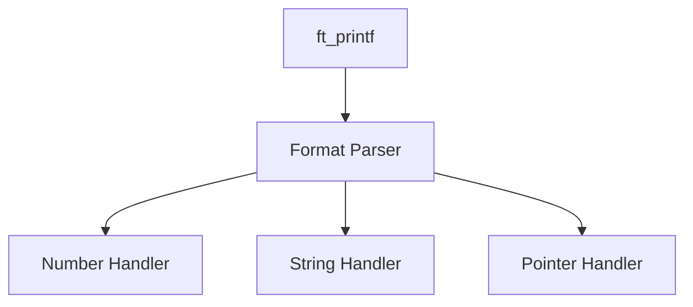

# 📝 ft_printf


> A lightweight implementation of printf with modular architecture and robust error handling.

## 📚 Table of Contents
- [Overview](#-overview)
- [Features](#-features)
- [Implementation](#-implementation)
- [Usage Examples](#-usage-examples)
- [Building](#-building)
- [Project Structure](#-project-structure)

## 🎯 Overview

`ft_printf` is a custom implementation of the standard C printf function, featuring:
- Modular code architecture
- Comprehensive error handling
- Zero external dependencies (except libft)

## ⭐ Features

### Format Specifiers
| Specifier | Description | Example |
|-----------|-------------|---------|
| %c | Single character | `ft_printf("%c", 'A')` |
| %s | String | `ft_printf("%s", "Hello")` |
| %p | Pointer address | `ft_printf("%p", ptr)` |
| %d, %i | Signed decimal | `ft_printf("%d", 42)` |
| %u | Unsigned decimal | `ft_printf("%u", 42)` |
| %x, %X | Hexadecimal | `ft_printf("%x", 255)` |
| %% | Percent sign | `ft_printf("%%")` |

## 🏗 Implementation

### Core Structure
```c
typedef struct s_printf {
    va_list args;    // Variable arguments
    int     len;     // Total output length
    char    type;    // Current format type
} t_printf;
```

### Component Overview


## 🚀 Usage Examples

### Basic Usage
```c
// String and character
ft_printf("Hello, %s!\n", "World");  // Hello, World!
ft_printf("Character: %c\n", 'A');   // Character: A

// Numbers
ft_printf("Decimal: %d\n", -42);     // Decimal: -42
ft_printf("Hex: %x\n", 255);         // Hex: ff
ft_printf("HEX: %X\n", 255);         // HEX: FF

// Pointers
int num = 42;
ft_printf("Pointer: %p\n", &num);    // Pointer: 0x7fff5fbff83c
```

## 🛠 Building

```bash
make        # Build library
make clean  # Clean objects
make fclean # Full clean
make re     # Rebuild
```

## 📁 Project Structure
```
ft_printf/
├── src/
│   ├── ft_printf.c    # Main printf implementation
│   ├── ft_formats.c   # Format specifier handlers
│   └── ft_numbers.c   # Number conversion utilities
├── includes/
│   └── ft_printf.h    # Header declarations
├── libft/            # Core utility functions
└── Makefile
```

## ⚠️ Limitations

- No floating point support
- No format flags
- No field width/precision
